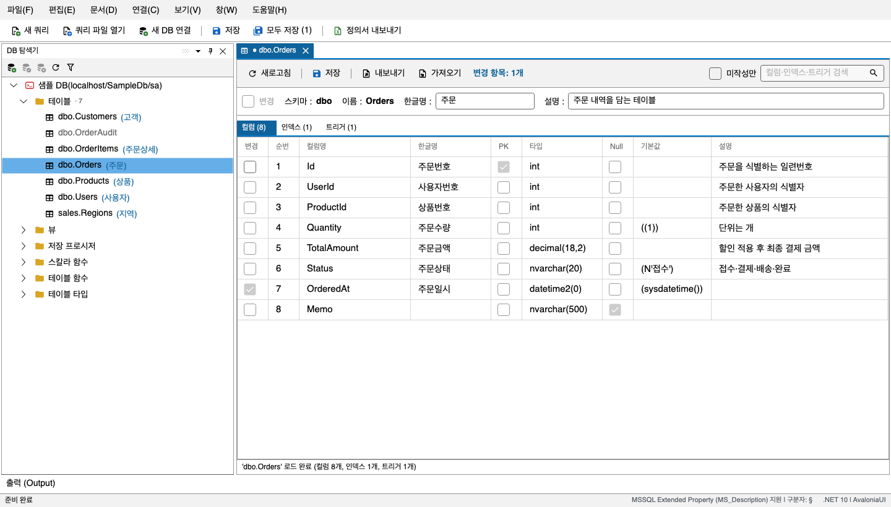

# SchemaForge

MS SQL Server 데이터베이스 객체에 **한글 업무 코멘트**(표시명 + 설명)를 붙이고 관리하는
크로스플랫폼 데스크톱 앱이다. Windows / macOS / Linux에서 동일하게 동작한다.

SSMS 속성 창을 객체마다 열거나 엑셀로 이중 관리하는 대신, DB 객체 목록을 트리와 그리드로
펼쳐 놓고 한글명·설명을 한 번에 훑어보며 편집하고, 변경된 것만 골라 저장한다.

> 이 저장소는 **설치 파일 배포용**이다. 소스 코드는 공개하지 않는다.

사용법은 [사용 설명서](docs/README.md)에 있다.

---

## 내려받기

[최신 릴리스](https://github.com/almyeonseo/SchemaForge-releases/releases/latest)의 **Assets**에서
OS에 맞는 파일을 받는다. 모두 .NET 런타임을 포함하고 있어 따로 설치하지 않는다.
Assets 맨 아래의 "Source code" 압축은 이 안내문뿐이라 받지 않는다.

| OS | 받기 쉬운 형식 | zip |
|---|---|---|
| Windows (x64) | `SchemaForge-<버전>-win-x64-setup.exe` | `SchemaForge-<버전>-win-x64.zip` |
| macOS (Intel) | `SchemaForge-<버전>-osx-x64.dmg` | `SchemaForge-<버전>-osx-x64.zip` |
| macOS (Apple Silicon) | `SchemaForge-<버전>-osx-arm64.dmg` | `SchemaForge-<버전>-osx-arm64.zip` |
| Linux (x64) | `SchemaForge-<버전>-x86_64.AppImage` | `SchemaForge-<버전>-linux-x64.zip` |

- **Windows** — setup.exe를 실행하면 관리자 권한 없이 설치되고 시작 메뉴에 등록된다(제거는
  설정 > 앱). 설치 없이 쓰려면 zip을 받아 압축을 풀고 `SchemaForge.UI.exe`를 실행한다.
- **macOS** — dmg를 열어 앱을 Applications로 끌어 넣는다. zip은 Finder에서 더블클릭해 풀
  것(터미널 `unzip`은 앱 서명을 깨뜨린다). 서명·공증을 하지 않은 앱이라 처음 실행이
  막히면 시스템 설정 > 개인정보 보호 및 보안에서 "그래도 열기"를 누른다.
- **Linux** — AppImage는 `chmod +x` 후 실행한다. zip은 압축을 푼 자리에서 처음 한 번
  `sh install.sh`를 실행하면 실행 권한이 붙고 앱 메뉴에 등록된다.

새 버전이 나오면 앱 하단 상태바에 링크가 나타난다(**도움말 > 업데이트 확인**으로 직접 확인할
수도 있다). 자동으로 내려받아 적용하지는 않으니 링크에서 새 파일을 받는다.
Windows 설치판은 새 setup.exe를 실행하면 덮어 설치되고, 연결 프로필과 저장된 비밀번호는
그대로 남는다.

SQL 편집기의 한글 IME 조합 표시는 macOS에서 확인을 마쳤고, Linux 확인과 Windows 재확인이
남아 있다. 각 릴리스의 "알려진 제약"을 함께 볼 것.

---

## 주요 기능

- **폭넓은 객체 지원** — 테이블, 컬럼, 뷰, 뷰 컬럼, 저장 프로시저, 스칼라/테이블 함수,
  파라미터, 인덱스, 트리거, 사용자 정의 테이블 타입과 그 컬럼의 `MS_Description` 확장 속성을
  읽고 쓴다.
- **한글명 + 설명 동시 관리** — 하나의 확장 속성 값에 `한글명§설명` 형태로 두 정보를 담는다.
- **변경분만 저장** — 편집한 항목만 골라 하나의 트랜잭션으로 일괄 저장한다.
- **저장 충돌 발견** — 내가 불러온 뒤 다른 사람이 같은 개체를 저장했으면, 저장 직전에 알려 주고
  항목별로 어느 값을 남길지 고르게 한다.
- **엑셀 정의서 내보내기** — 개체당 시트 하나 + 분류별 목록 시트, 표제부를 갖춘 제출용 문서를
  만든다. Excel이 설치되어 있지 않아도 된다.
- **CSV / Excel 가져오기·내보내기** — 가져온 값은 그리드에 채워질 뿐이고, 확인한 뒤 저장을
  눌러야 DB에 반영된다.
- **미작성만 보기** — 한글명이 비어 있는 항목만 걸러 보고, `F8`(이전은 `Shift+F8`)로 다음 미작성
  항목으로 이동한다.
- **SQL 편집기** — 고른 연결에 SQL을 실행해 결과를 표로 보고, 엑셀·CSV로 저장한다. 실행 전에
  예상 영향 규모를 보여 주고, 실패하면 전체를 롤백한다.

---

## 사용 전에 알아 둘 것

- **비밀번호 보호 수준** — 연결 비밀번호는 AES-256-GCM으로 암호화해 저장하고, 키는 설치별로
  무작위로 만들어 DB 파일 옆에 둔다. DB 파일이 실수로 노출됐을 때 평문 유출을 막는 수준이며,
  OS 보안 저장소(Keychain 등) 연동은 아니다.
- **데이터 위치** — 연결 프로필과 설정은 아래 폴더의 `SchemaForge.db`에, 예상하지 못한 오류는
  같은 폴더의 `logs/error.log`에 남는다(**도움말 > 오류 로그 폴더 열기**).

  | OS | 폴더 |
  |---|---|
  | Windows | 사용자 AppData(Roaming) 폴더 아래 `SchemaForge` |
  | macOS | `~/Library/Application Support/SchemaForge` |
  | Linux | `~/.config/SchemaForge` |

- **지원하지 않는 것** — MS SQL Server 이외의 DBMS, DDL(스키마 자체) 관리, 편집 잠금,
  변경 이력(감사 로그), 한글명에 `§` 넣기.

---

## 문의·버그 제보

[Issues](https://github.com/almyeonseo/SchemaForge-releases/issues)에 남긴다. 오류가 났다면
`logs/error.log`를 함께 첨부하면 원인을 찾는 데 도움이 된다(연결 문자열의 비밀번호는
지운 뒤 기록된다).
