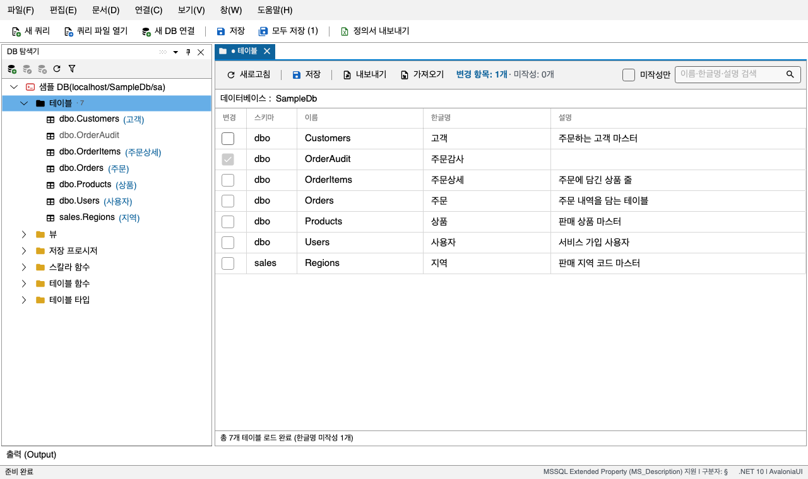
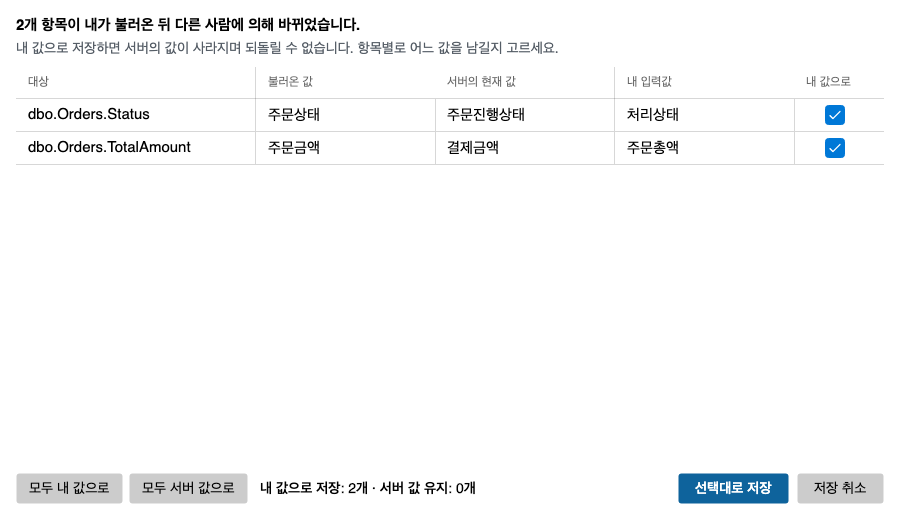

# 2. 코멘트 달기

[목차](README.md) · 이전: [1. 시작하기](getting-started.md) · 다음: [3. 파일로 주고받기](import-export.md)

## 2.1 코멘트는 어디에 저장되나

SchemaForge는 개체마다 **한글명**과 **설명**을 받아, SQL Server의 `MS_Description` 확장 속성 하나에
`§`로 이어 붙여 저장한다.

```
주문내역§고객이 주문한 상품의 내역을 보관하는 테이블
└ 한글명 ┘└──────────── 설명 ────────────────────┘
```

SSMS 속성 창에서 보면 이 모양 그대로 보인다. 같은 DB를 쓰는 기존 프로그램과 맞추려고 정한 형식이다.

다룰 수 있는 개체는 테이블, 컬럼, 뷰, 뷰 컬럼, 저장 프로시저, 스칼라·테이블 함수, 파라미터, 인덱스,
트리거, 사용자 정의 테이블 타입과 그 컬럼이다.

## 2.2 두 가지 편집 화면

| 하려는 일 | 여는 법 | 화면 |
|---|---|---|
| 한 분류의 개체 이름을 죽 훑으며 한글명 채우기 | 분류 폴더 오른쪽 클릭 > `테이블 코멘트 관리` 등 | **분류 목록 문서** — 탭 제목이 `테이블` |
| 개체 하나의 컬럼·파라미터까지 채우기 | 개체 더블클릭 (또는 오른쪽 클릭 > `코멘트 관리`) | **개체 문서** — 탭 제목이 `dbo.Orders` |

### 분류 목록 문서



그리드 한 장에 `변경 · 스키마 · 이름 · 한글명 · 설명`이 있다. 툴바에 `미작성: N개`가 함께 보여 남은
분량을 알 수 있다.

### 개체 문서


맨 위 머리글에서 개체 자신의 한글명·설명을 고치고, 그 아래에서 하위 항목을 고친다.

| 개체 | 머리글 아래 |
|---|---|
| 테이블 | `컬럼` · `인덱스` · `트리거` 탭 |
| 뷰 | `컬럼` · `인덱스` · `트리거` 탭 |
| 저장 프로시저 · 함수 | 파라미터 그리드 |
| 테이블 타입 | 컬럼 그리드 |

탭 머리글의 숫자(`컬럼 (12)`)는 지금 보이는 항목 수다.

## 2.3 값 입력하기

1. 고칠 칸을 한 번 클릭해 고른다.
2. **같은 칸을 한 번 더 클릭하거나 `F2`**를 누르면 입력 상태가 된다. 칸을 고른 채 바로 타이핑해서는 입력이 시작되지 않는다.
3. 입력한 뒤 `Tab`을 누르면 값이 들어가고 옆 칸도 입력 상태로 이어진다. `Enter`는 입력을 끝내고 아래 행으로 내려간다.

편집하면 이렇게 표시된다.

- 그 행의 `변경` 칸에 체크가 생긴다.
- 툴바에 `변경 항목: N개`가 보인다.
- 탭 제목 앞에 `●`가 붙는다.
- 툴바의 **모두 저장** 버튼에 변경이 남은 문서 수가 붙는다. 예: `모두 저장 (2)`

값을 원래대로 되돌리면 표시도 사라진다.

### 지킬 것

- **한글명에는 `§`를 넣을 수 없다.** 한글명과 설명을 가르는 문자라서다. 설명에는 넣어도 된다.
- 한글명과 설명을 합쳐 **7,500바이트(한글 약 3,750자)**를 넘으면 저장하지 않는다.
- 한글명과 설명을 모두 비우고 저장하면 그 개체의 확장 속성을 지운다.

위반한 값이 있으면 저장을 시작하지 않고, 어느 항목이 문제인지 알려 준다. 하나라도 걸리면 아무것도 저장하지 않는다.

## 2.4 채울 곳만 보기

| 기능 | 쓰는 법 | 걸리는 곳 |
|---|---|---|
| `미작성만` | 툴바 오른쪽 토글 | 한글명이 빈 개체와 하위 항목만 남긴다 |
| 검색 | 툴바 검색 칸에 쓰고 `Enter` 또는 돋보기. `✕`로 지운다 | 분류 목록 문서는 개체를, 개체 문서는 컬럼·파라미터 같은 하위 항목을 거른다 |
| 다음 미작성 항목 | `F8` (이전은 `Shift+F8`) | 한글명이 빈 다음 칸으로 간다. 탭이 여럿이면 지금 탭 안에서만 움직인다 |

- 거르기는 DB를 다시 읽지 않는다. 편집하던 값은 사라지지 않는다.
- `미작성만`을 켠 뒤 한글명을 채워도 그 행은 바로 사라지지 않는다. 방금 넣은 값을 확인할 수 있게 하려는 것이다. 토글이나 검색을 다시 누르면 빠진다.

## 2.5 저장하기

| 방법 | 저장하는 것 |
|---|---|
| **저장** `Ctrl+S` (문서 툴바, 파일 메뉴, 메인 툴바) | 지금 탭의 변경된 항목만 |
| **모두 저장** `Ctrl+Shift+S` | 열려 있는 탭 중 변경이 있는 것 전부. DB 전체가 아니다 |

변경된 항목만 하나의 트랜잭션으로 저장한다. 하나가 실패하면 그 문서의 저장은 모두 취소된다. 저장이
끝나면 DB 탐색기의 한글명도 바뀌고, 출력 창에 기록이 남는다.

모두 저장은 탭을 하나씩 차례로 저장한다. 한 탭이 막혀도 나머지는 계속 저장하고, 상태바에
`저장 N개 · 건너뜀 M개 · 변경 없음 K개`가 보인다. 건너뛴 탭과 그 이유는 출력 창에 남는다.

### 저장하지 않은 편집을 지키는 장치

- 변경이 남은 탭이나 앱을 닫으면 `저장 / 저장 안 함 / 취소`를 묻는다. 여러 탭을 한꺼번에 닫아도 한 번만 묻는다.
- 변경이 남은 문서에서 **새로고침**을 누르면, 편집을 버리고 다시 읽을지 먼저 묻는다.

## 2.6 저장 충돌

내가 문서를 연 뒤 다른 사람이 같은 항목을 저장했으면, 저장 직전에 그 사실을 알려 준다. 모르고
남의 값을 덮어쓰지 않게 하려는 것이다.



| 칸 | 뜻 |
|---|---|
| 불러온 값 | 내가 문서를 열었을 때의 값 |
| 서버의 현재 값 | 다른 사람이 저장한 값 |
| 내 입력값 | 내가 지금 저장하려는 값 |
| 내 값으로 | 체크하면 내 값으로 덮어쓰고, 끄면 서버 값을 그대로 둔다 |

- 처음에는 모든 행이 `내 값으로`에 체크되어 있다.
- **모두 내 값으로**와 **모두 서버 값으로**로 한꺼번에 바꿀 수 있다.
- **선택대로 저장**을 누르면 체크한 행만 저장한다. 체크를 끈 행은 화면 값이 서버 값으로 바뀌고, 내 입력값은 버려진다.
- **저장 취소**(또는 `Esc`)를 누르면 아무것도 저장하지 않고, 편집한 값은 그대로 남는다.

다른 사람이 나와 같은 값으로 바꿨으면 충돌로 보지 않는다. 공백만 다른 경우도 같다.

이 기능은 덮어쓰기 전에 알려 줄 뿐, 다른 사람의 편집을 막지는 않는다. 앱은 변경 이력도 남기지 않는다.
