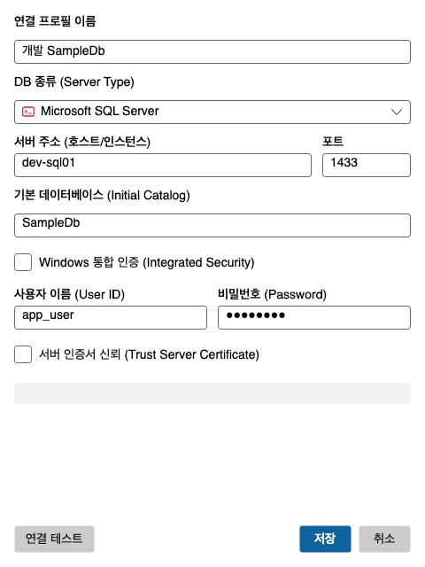

# 1. 시작하기

[목차](README.md) · 다음: [2. 코멘트 달기](comments.md)

## 1.1 설치

[최신 릴리스](https://github.com/almyeonseo/SchemaForge-releases/releases/latest)의 **Assets**에서 OS에 맞는
파일을 받는다. .NET 런타임이 들어 있어 따로 설치할 것이 없다.

| OS | 받을 파일 | 설치 |
|---|---|---|
| Windows (x64) | `SchemaForge-<버전>-win-x64-setup.exe` | 실행하면 관리자 권한 없이 설치되고 시작 메뉴에 등록된다. 제거는 설정 > 앱 |
| macOS (Apple Silicon) | `SchemaForge-<버전>-osx-arm64.dmg` | dmg를 열어 앱을 Applications로 끌어 넣는다 |
| macOS (Intel) | `SchemaForge-<버전>-osx-x64.dmg` | 위와 같다 |
| Linux (x64) | `SchemaForge-<버전>-x86_64.AppImage` | `chmod +x` 후 실행한다 |

설치 없이 쓰려면 같은 버전의 zip을 받는다.

- **Windows zip** — 압축을 풀고 `SchemaForge.UI.exe`를 실행한다.
- **macOS zip** — Finder에서 더블클릭해 푼다. 터미널 `unzip`으로 풀면 앱 서명이 깨져 실행이 막힌다.
- **Linux zip** — 압축을 푼 자리에서 처음 한 번 `sh install.sh`를 실행한다. 실행 권한이 붙고 앱 메뉴에 등록된다.

macOS에서 처음 실행이 막히면 시스템 설정 > 개인정보 보호 및 보안에서 **그래도 열기**를 누른다.
서명·공증을 하지 않은 앱이라 한 번은 이 단계를 거친다.

## 1.2 화면 구성

| 영역 | 하는 일 |
|---|---|
| 메뉴·툴바 | 파일·편집·문서·연결·보기·창·도움말 메뉴와 자주 쓰는 버튼(새 쿼리, 쿼리 파일 열기, 새 DB 연결, 저장, 모두 저장, 정의서 내보내기) |
| DB 탐색기 (왼쪽) | 등록한 연결과 그 안의 개체를 트리로 본다 |
| 문서 영역 (가운데) | 코멘트를 편집하는 문서와 SQL 편집기가 탭으로 열린다 |
| 출력 (아래) | 저장·SQL 실행 기록과 오류가 남는다. 오류는 빨강, 경고는 주황이다 |
| 상태바 (맨 아래) | 방금 한 일의 결과. 새 버전이 있으면 여기에 링크가 나타난다 |

패널을 닫았거나 배치가 흐트러졌으면 **보기 > 레이아웃 초기화**로 되돌린다. DB 탐색기와 출력 창은
**보기** 메뉴에서 다시 연다.

## 1.3 DB 연결 만들기

앱을 처음 켜면 시작 페이지가 뜬다. **새 DB 연결**을 누른다. 시작 페이지를 닫았으면 툴바의
**새 DB 연결** 또는 `Ctrl+Shift+N`을 쓴다.

| 칸 | 적을 것 |
|---|---|
| 연결 프로필 이름 | 트리에 보일 이름. 예: `개발 SalesDB` (필수) |
| DB 종류 | `Microsoft SQL Server` (지금은 이것만 고를 수 있다) |
| 서버 주소 · 포트 | 예: `dev-sql01`, `1433` (서버 주소 필수) |
| 기본 데이터베이스 | 코멘트를 관리할 DB 이름 |
| Windows 통합 인증 | 켜면 지금 로그인한 Windows 계정으로 접속한다. 끄면 아래 두 칸이 나온다 |
| 사용자 이름 · 비밀번호 | SQL Server 인증 계정 (통합 인증을 끈 경우 사용자 이름 필수) |
| 서버 인증서 신뢰 | 서버가 자체 서명 인증서를 쓸 때 켠다 |

**연결 테스트**로 접속되는지 먼저 확인한 뒤 **저장**을 누른다. 필수 칸이 비어 있으면 **저장**이
꺼지고, 무엇이 비었는지 버튼 위에 적힌다.

접속 계정에는 확장 속성을 추가·수정·삭제할 권한이 있어야 저장할 수 있다. 읽기 권한만 있으면
보기와 정의서 내보내기까지만 된다.

비밀번호는 이 PC에 암호화해 저장한다. 보호 수준은 [6.3 데이터 저장 위치](troubleshooting.md#63-데이터-저장-위치)를 볼 것.

### 연결 고치기와 지우기

트리에서 서버를 오른쪽 클릭하고 **DB 연결 수정...** 또는 **DB 연결 제거...**를 고른다. **연결** 메뉴에도
같은 항목이 있다. 제거하면 저장한 비밀번호도 함께 지워져 되돌릴 수 없으므로, 한 번 더 묻는다.

## 1.4 DB 탐색기 쓰기

트리는 `서버 → 분류 폴더 → 개체` 3단이다.

| 노드 | 보이는 것 |
|---|---|
| 서버 | `프로필명(서버주소/DB명/계정)` |
| 분류 폴더 | 테이블 · 뷰 · 저장 프로시저 · 스칼라 함수 · 테이블 함수 · 테이블 타입, 그리고 개수 |
| 개체 | `스키마.이름 (한글명)`. **한글명이 없는 개체는 흐리게** 보인다 |

- **서버와 폴더는 더블클릭으로 펼치고 접는다.** 폴더는 처음 펼칠 때 개체 목록을 읽어 온다.
- **개체를 더블클릭하면** 그 개체의 코멘트 문서가 열린다([2장](comments.md)).
- 같은 개체를 다시 열면 이미 열린 탭으로 옮겨 갈 뿐, 다시 읽지 않는다. 편집하던 값은 그대로다.

### 오른쪽 클릭 메뉴

| 누른 곳 | 항목 |
|---|---|
| 서버 | 새 쿼리 · 정의서 내보내기 · DB 연결 수정 · DB 연결 제거 · 새로고침 |
| 분류 폴더 | `{분류} 코멘트 관리` · 새 쿼리 · 내보내기 · 가져오기 · 정의서 내보내기 · 새로고침 |
| 개체 | 코멘트 관리 · 새 쿼리 · 상위 100개 행 선택(테이블·뷰) · 내보내기 · 가져오기 · 정의서 내보내기 · 이름 복사 · 한글명 복사 |
| 빈 곳 | 새 DB 연결 · 새로고침 |

- 폴더의 **새로고침**은 그 폴더만 다시 읽는다. 서버·빈 곳의 **새로고침**(또는 탐색기 안에서 `F5`)은 연결 목록부터 다시 읽는다.
- **이름 복사**는 `[스키마].[이름]`을 클립보드에 넣는다.
- 키보드로는 메뉴 키나 `Shift+F10`으로 연다.

### 개체 찾기

탐색기 툴바의 깔때기 버튼을 누르면 검색 칸이 열린다. 찾을 **연결을 하나 고르고** 검색어를 넣은 뒤
`Enter`를 누른다. 검색창을 닫으면 필터도 풀린다.

검색은 한 번에 한 연결만 본다. 모든 연결을 뒤지면 쓰지 않는 서버에까지 한꺼번에 접속하기 때문이다.
