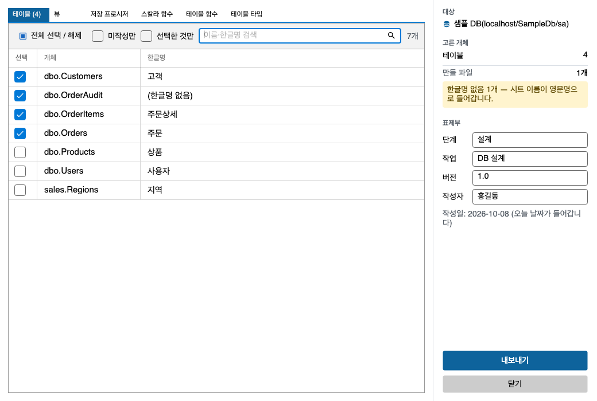

# 3. 파일로 주고받기

[목차](README.md) · 이전: [2. 코멘트 달기](comments.md) · 다음: [4. SQL 편집기](sql-editor.md)

파일로 내보내는 기능은 두 가지다. 용도가 다르다.

| | 내보내기 · 가져오기 | 정의서 내보내기 |
|---|---|---|
| 용도 | 엑셀에서 고친 뒤 다시 가져오기 | 사람이 읽는 제출용 문서 |
| 양식 | 시트 한 장, 6칸 | 개체당 시트 한 장 + 목록 시트, 표제부 포함 |
| 범위 | 지금 문서에 읽어 온 것 | 목록에서 체크한 개체 |
| 다시 가져오기 | 된다 | 안 된다 |

## 3.1 내보내기

코멘트 문서의 툴바에서 **내보내기**를 누른다. 트리의 폴더나 개체를 오른쪽 클릭해 **내보내기...**를 골라도 된다.
이렇게 하면 그 문서를 연 뒤 같은 흐름으로 진행한다.

- 파일 이름이 `.xlsx`로 끝나면 Excel, 그 밖은 CSV로 저장한다. CSV는 엑셀에서 한글이 깨지지 않게 UTF-8(BOM)로 쓴다.
- 칸은 `개체유형 · 스키마 · 상위개체 · 이름 · 한글명 · 설명`이다. `개체유형`은 `Table`, `Column`, `Procedure` 같은 영문 이름이다.
- 지금 문서에 읽어 온 범위만 내보낸다. 저장하지 않은 편집도 들어간다.
- `미작성만`이나 검색으로 걸러 둔 상태여도 문서의 전체 항목을 내보낸다.

## 3.2 가져오기

1. 내보낸 파일을 엑셀에서 열어 `한글명`·`설명` 칸을 고친다. 다른 칸은 그대로 둔다. 다른 칸으로 행을 찾아 맞추기 때문이다.
2. 같은 문서에서 **가져오기**를 누르고 파일을 고른다.
3. 값이 그리드에 채워지고 `변경 항목: N개`가 늘어난다. **아직 DB에는 아무것도 쓰지 않았다.**
4. 그리드에서 바뀐 값을 눈으로 확인한 뒤 **저장**을 누른다.

가져오지 못한 행은 이유별로 알려 준다.

| 이유 | 뜻 |
|---|---|
| 매칭 실패 | 문서에 그 개체·항목이 없다. 이름이 바뀌었거나 다른 문서에서 내보낸 파일이다 |
| `§` 포함 | 한글명에 `§`가 들어 있다 |
| 길이 초과 | 한글명과 설명을 합쳐 7,500바이트를 넘는다 |

- 엑셀에서 `CSV (쉼표로 분리)`로 다시 저장한 파일도 한글이 깨지지 않고 읽힌다. 인코딩을 알아서 판별한다.
- 어떤 인코딩으로도 읽을 수 없는 파일은 가져오지 않고 이유를 알려 준다. 그리드는 그대로다.
- 지금 문서에 읽어 온 항목에만 채운다. 다른 문서에서 내보낸 행은 매칭 실패로 나온다. 예를 들어 테이블 문서에서는 그 테이블의 행만 들어간다.

## 3.3 정의서 내보내기

외부에 제출하는 엑셀 정의서를 만든다. Excel이 설치되어 있지 않아도 된다.

**여는 법** — 트리에서 서버·폴더·개체 중 하나를 고르고, 툴바의 **정의서 내보내기**, **파일 > 정의서 내보내기...**,
또는 오른쪽 클릭 메뉴의 **정의서 내보내기...**를 누른다.

| 고른 노드 | 처음 모습 |
|---|---|
| 서버 | `테이블` 탭, 체크 없음 |
| 분류 폴더 | 그 분류 탭, 체크 없음 |
| 개체 | 그 분류 탭, 그 개체만 체크 |

### 1단계: 개체 고르기

- 분류마다 탭이 있고, 탭 머리글에 고른 개수가 붙는다. 예: `테이블 (12)`
- 줄의 체크박스를 눌러 고른다. **전체 선택 / 해제**는 지금 보이는 줄에만 적용된다.
- 거르기: 검색 칸(이름·한글명), `미작성만`(한글명이 없는 것), `선택한 것만`(체크한 것만 다시 훑어보기). 걸러도 체크는 그대로 남는다.
- 키보드: 줄을 고르고 `Space`로 체크, `Ctrl+Tab`·`Ctrl+Shift+Tab`으로 분류 탭 이동. macOS에서도 이 두 키는 `Control`이다.
- 오른쪽 패널의 **고른 개체**에 분류별 개수와 **만들 파일 N개**가 보인다.

### 2단계: 표제부

`단계 · 작업 · 버전 · 작성자`를 적는다. 마지막에 쓴 값을 기억하므로 대개 다시 적을 일이 없다.
**작성일**은 오늘 날짜가 자동으로 들어가고 바꿀 수 없다. 페이지 번호도 자동이다.
빈 칸이 있어도 만들 수는 있다. 어느 칸이 비었는지 표제부 아래에 적힌다.

### 3단계: 내보내기

**내보내기**를 누르고 저장할 곳을 고른다. 기본 파일 이름은 `DB명_정의서_YYYYMMDD.xlsx`다.

- **분류를 여러 개 고르면 분류마다 파일을 따로 만든다.** 예: `x_테이블.xlsx`, `x_뷰.xlsx`
- 만들 파일 중 이미 있는 것이 있으면, 실제로 덮어쓸 파일 이름을 모두 보여 주고 묻는다.
- **중단**을 누르면 멈춘다. 만들던 파일은 남기지 않고, 원래 있던 파일도 건드리지 않는다.
- 끝나면 **폴더 열기**로 저장한 폴더를 연다.

### 만들어지는 파일

| 시트 | 내용 |
|---|---|
| 개체마다 한 장 | 표제부, 개체 정보, 컬럼·파라미터 등 하위 항목 표. 시트 이름은 한글명이다 |
| `목록` | 고른 개체의 목록 |

- 한글명이 없는 개체는 시트 이름이 영문 이름이 되고, 목록 시트의 한글명 칸은 비어 있다. 고른 것 중 몇 개가 그런지 오른쪽 패널에 적힌다.
- 한글명이 같은 개체가 여럿이면 시트 이름 뒤에 `_2`, `_3`이 붙는다.
- 200개 이상 고르면 시간이 걸릴 수 있다고 미리 알려 준다. 개체 하나에 시트 하나가 만들어지기 때문이다. 막지는 않는다.
