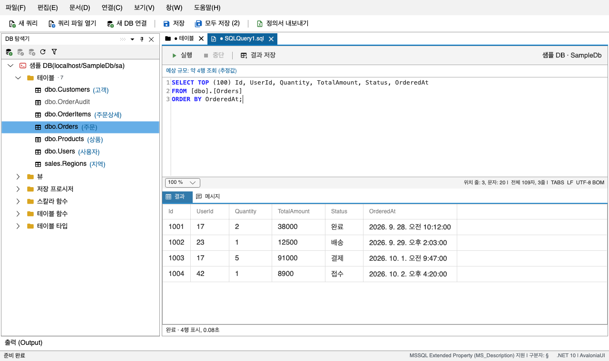

# 4. SQL 편집기

[목차](README.md) · 이전: [3. 파일로 주고받기](import-export.md) · 다음: [5. 설정과 단축키](settings-shortcuts.md)

고른 연결에 SQL을 실행하고 결과를 표로 본다. 데이터를 확인하거나 조금 고칠 때 쓴다.
대량 변경이나 마이그레이션 스크립트에는 SSMS 같은 전용 도구를 쓸 것.

## 4.1 열기

먼저 **DB 탐색기에서 연결(또는 그 안의 노드)을 고른다.** 편집기는 고른 연결을 대상으로 열린다.

| 방법 | 동작 |
|---|---|
| **파일 > 새 쿼리** `Ctrl+N`, 툴바, 오른쪽 클릭 `새 쿼리` | 빈 편집기를 연다. 여러 개를 동시에 열 수 있다 |
| 테이블·뷰 오른쪽 클릭 > `상위 100개 행 선택` | `SELECT TOP (100) * FROM [스키마].[이름];`을 채워 연다. **실행은 하지 않는다** |
| **파일 > 쿼리 파일 열기** `Ctrl+O` | `.sql` 파일을 고른 연결에 붙여 연다 |
| **파일 > 최근 쿼리 파일** | 최근에 열거나 저장한 파일 10개 |

연결을 고르지 않고 `Ctrl+N`을 누르면 상태바에 안내가 뜬다.

트리의 개체를 편집기로 끌어다 놓으면, 놓은 자리에 `[스키마].[이름]`이 들어간다.

## 4.2 실행하기

`F5`, `Ctrl+Enter`(macOS `⌘↩`), 또는 툴바의 **실행**을 누른다.

- **누르면 묻지 않고 바로 실행한다.** 실행 전에 확인 창이 뜨지 않는다.
- **글자를 선택해 두면 선택한 부분만 실행한다.**
- 실행은 트랜잭션으로 감싼다. 중간에 실패하면 그때까지 한 변경을 모두 되돌린다. 성공하면 커밋되고, 앱에서 되돌릴 방법은 없다.
- **중단**(`Ctrl+.`, macOS `⌘.`)을 누르면 실행을 멈추고 되돌린다.
- 실행 기록(대상, SQL 본문, 서버 메시지, 영향 행 수, 성공 여부)은 출력 창에 남는다.

`F5`는 DB 탐색기에 포커스가 있으면 실행이 아니라 탐색기 새로고침이다. `Ctrl+Enter`는 포커스와 상관없이 실행이다.

### 오류가 나면

- `메시지` 탭에 오류마다 편집기 기준 줄 번호와 오류 번호가 붙는다(`줄 12(오류 번호 208): …`). 선택 영역을 실행했어도 편집기의 줄 번호다.
- 줄을 알 수 있으면 `메시지` 탭 아래 **N줄로 이동**을 누른다. 그 줄 전체가 선택되므로, 고친 뒤 바로 실행하면 그 줄만 실행된다.
- 실패하기 전까지 받은 메시지(문장별 행 수, `PRINT`)가 오류 앞에 나온다. 어디까지 실행되다 멈췄는지 알 수 있다. 이 행 수는 되돌려진 것이다.
- SQL 안에 `COMMIT`이 있었으면 그 앞 문장은 되돌려지지 않는다. 이때는 오류 문구가 그렇다고 알려 준다.
- `ALTER DATABASE`, `CREATE DATABASE`, `BACKUP`처럼 트랜잭션 안에서 쓸 수 없는 문장은 실행할 수 없다. 실행 전체를 트랜잭션으로 감싸기 때문이다.

### 예상 규모 줄

툴바 바로 아래 줄은 실행하기 전에 무슨 일이 일어날지 알려 준다. 입력을 멈추면 서버에 실행 계획만
물어보고, 실제로 실행하지는 않는다.

| 표시 | 뜻 |
|---|---|
| `예상 규모: 약 32,000행 변경 · 약 10행 조회 (추정값)` | 실행 계획으로 추정한 행 수. 바꾸는 문장과 조회 문장을 나눠 적는다. 실제와 다를 수 있다 |
| `… · 일부 일괄 처리는 알 수 없음 (추정값)` | `GO`로 나뉜 스크립트에서 앞 부분이 만드는 개체를 쓰는 부분은 미리 알 수 없다 |
| `예상 규모를 알 수 없습니다` | 동적 SQL이거나 계정에 `SHOWPLAN` 권한이 없다. 0행이라는 뜻이 아니다 |
| `구문 오류(줄 3, 오류 번호 102): …` | 실행하기 전에 찾은 오타 |

선택 영역이 있으면 문구 앞에 `선택 영역 ·`이 붙고, 선택한 부분만 추정한다.

### `GO`로 나뉜 스크립트

SSMS처럼 `GO` 줄에서 나눠 차례로 실행한다. `CREATE PROCEDURE`처럼 맨 앞에 와야 하는 문장도 쓸 수 있다.

- **스크립트 전체가 트랜잭션 하나다.** 중간 부분이 실패하면 앞 부분까지 모두 되돌린다. SSMS는 부분마다 따로 반영되니 다르다.
- `GO 5`처럼 반복 횟수를 붙인 줄은 지원하지 않는다. 있으면 아무것도 실행하지 않고 알려 준다.
- 문자열이나 `/* */` 주석 안의 `GO` 줄로는 나누지 않는다.

## 4.3 결과 보기

- 결과 집합이 여럿이면 `결과 1`, `결과 2` 탭으로 나뉜다. `메시지` 탭에는 문장마다의 영향 행 수와 `PRINT` 출력, 걸린 시간, 오류가 나온다.
  메시지가 1,000건을 넘으면 앞뒤 500건씩만 남기고 가운데는 건수만 적는다.
- 결과 표는 읽기 전용이다. 정렬은 하지 않는다 — 필요하면 SQL에 `ORDER BY`를 쓴다.
- NULL은 흐린 기울임꼴 `NULL`로 보인다. 빈 문자열(`''`)은 빈칸이다. 바이너리는 `0x…` 16진수로 보인다.
- 줄을 고르고 `Ctrl+C`로 복사한다. `Ctrl+Shift+C`는 칸 이름 줄까지 함께 복사한다. 엑셀에 붙여 넣으면 칸이 맞게 들어간다. NULL은 `NULL`로 복사된다.
- 표를 오른쪽 클릭하면 **값 복사**(누른 칸 하나), **줄 복사**, **머리글과 함께 복사**가 있다.
- 기본으로 **모든 행을** 보여 준다. 수백만 행짜리 테이블을 통째로 조회하면 앱이 멈추거나 메모리 부족으로 꺼질 수 있으니, 그럴 때는 **중단**으로 멈춘다.
  [설정](settings-shortcuts.md)에서 행 상한을 걸면 그만큼만 보여 주고, 더 있으면 표 아래에 `상위 N행 표시 · 더 있음`이 적힌다.
- 실행 시간 제한도 기본은 없다. 설정에서 걸면 그 시간을 넘긴 실행은 멈추고 되돌린다.

### 결과 저장

**결과 저장**은 지금 보고 있는 결과 탭 하나를 파일로 저장한다. 파일 이름이 `.xlsx`로 끝나면 Excel, 그 밖은 CSV다.
엑셀 파일에서는 숫자·날짜가 글자가 아니라 숫자·날짜로 들어간다.

결과가 행 상한에 걸려 잘렸으면 저장하기 전에 한 번 묻는다. 파일에는 잘렸다는 표시가 남지 않기 때문이다.

## 4.4 쿼리를 파일로 저장하기

- SQL 편집기 탭에서 `Ctrl+S`는 DB가 아니라 **`.sql` 파일로 저장**한다. 처음이면 저장할 곳을 묻는다. 다른 이름으로 저장하려면 **파일 > 다른 이름으로 저장**을 쓴다.
- 예전 SSMS가 저장한 한글 ANSI 파일도 깨지지 않고 열리고, 연 인코딩 그대로 저장한다.
- 저장하지 않은 채 탭이나 앱을 닫으면 저장할지 묻는다.
- 실행 중인 탭을 닫으려 하면 `중단하고 닫기 / 취소`를 묻는다. 중단하면 그 실행은 되돌려진다.

## 4.5 편집 기능

**편집** 메뉴(SQL 편집기 탭에서만 켜진다)에 실행 취소, 다시 실행, 잘라내기, 복사, 붙여넣기, 찾기, 주석 처리, 주석 해제가 있다.
찾기는 `Ctrl+F`, 다음·이전은 `F3`·`Shift+F3`, 닫기는 `Esc`다. 편집기 아래 줄에서 확대 비율을 바꾼다.

**주석 처리**는 SSMS와 같이 `Ctrl+K`에 이어 `Ctrl+C`, **주석 해제**는 `Ctrl+K`에 이어 `Ctrl+U`다(macOS는 `⌘`).
고른 줄들(고른 것이 없으면 커서가 있는 줄)의 앞에 `--`를 붙이거나 뗀다. 실행 취소 한 번으로 되돌아간다.
`Ctrl+K`를 누른 뒤에는 편집기 아래 줄에 두 번째 키를 기다린다고 나온다.
